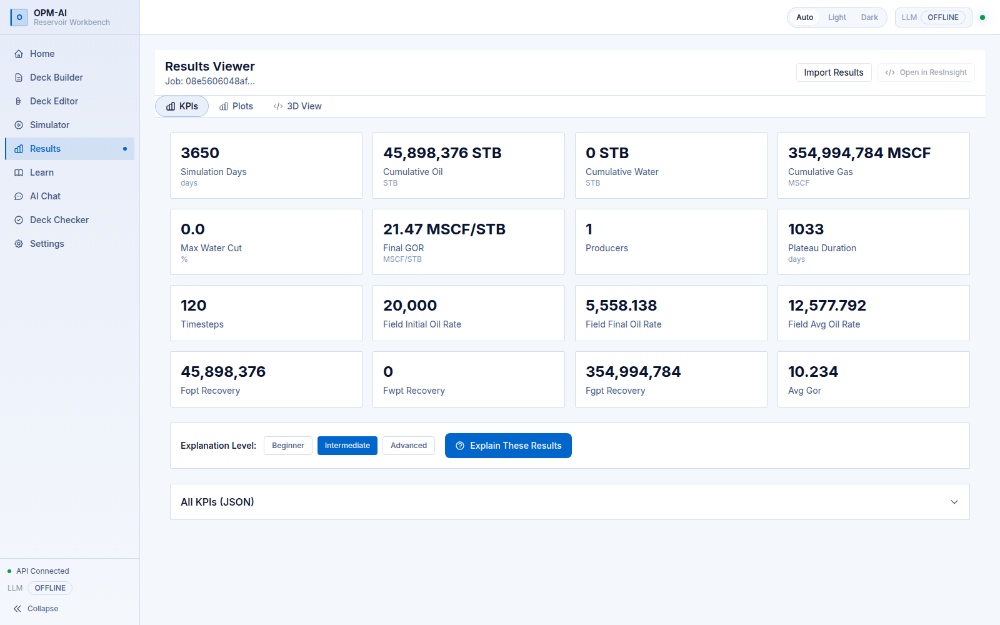
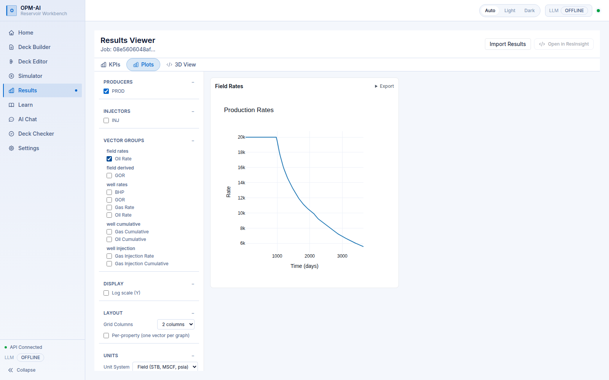
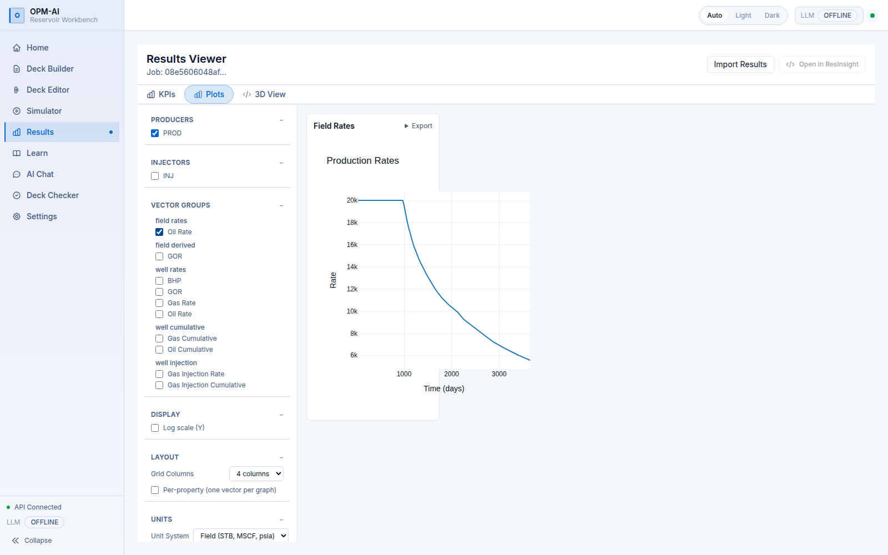
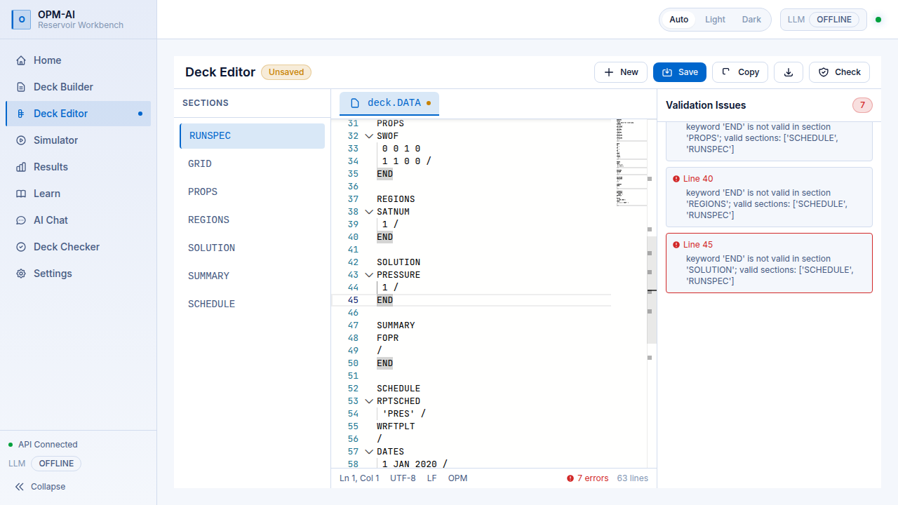
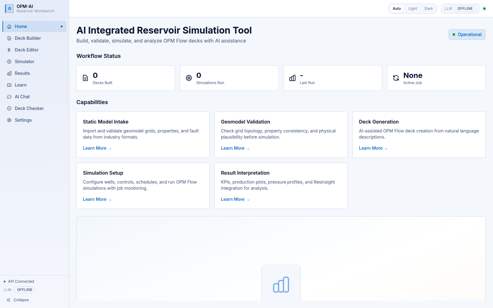
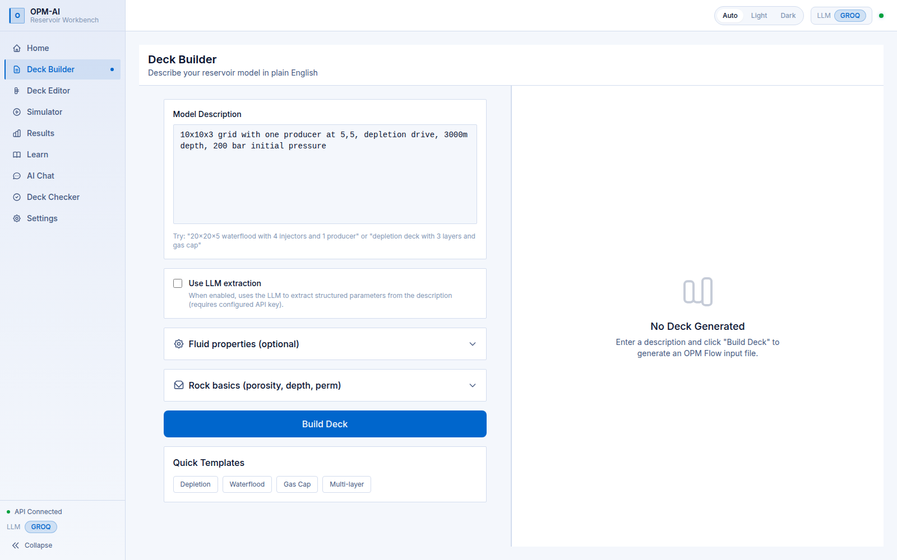
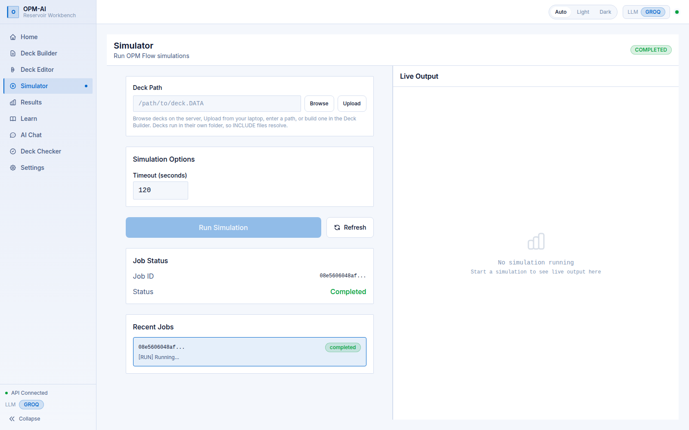
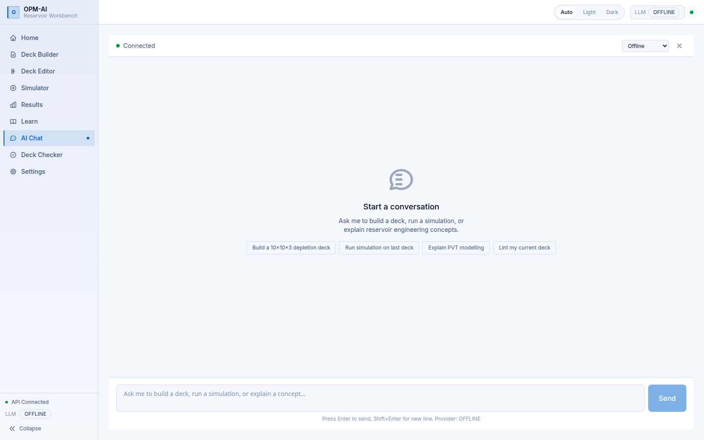
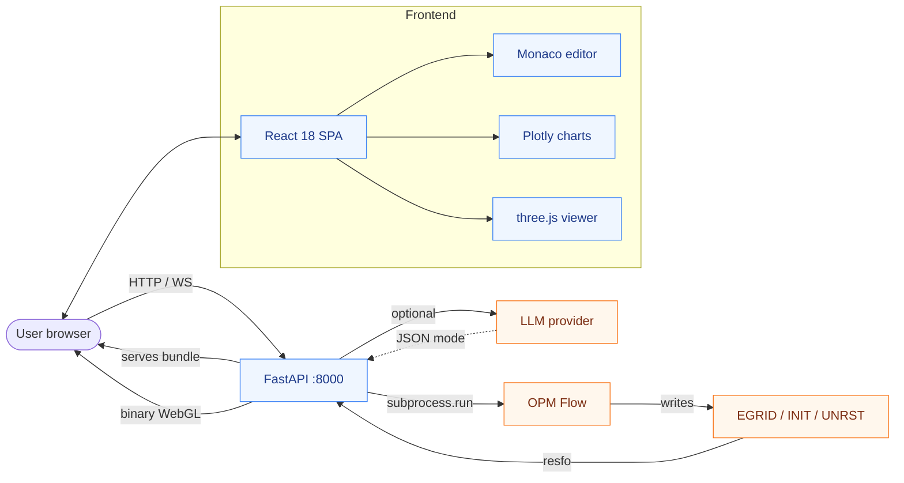

<div align="center">

# OPM-AI

### An AI-assisted workbench for reservoir simulation, built on the open-source [OPM Flow](https://opm-project.org/) simulator.

*Describe a reservoir in plain English. Get back a valid deck, a lint report, a 3D view of the grid, and a chat that explains what the numbers mean.*

<br>

[](https://www.python.org/)
[](./LICENSE)
[](#development)
[](https://opm-project.org/)
[](https://react.dev/)
[](https://fastapi.tiangolo.com/)

</div>

<br>

<div align="center">

### Developer and Author: **Pranay Gupta**

[](https://www.linkedin.com/in/pranay-ism/)

</div>

---

## Preview

<p align="center">
  
  &nbsp;
  
</p>

<p align="center">
  
  &nbsp;
  
</p>

---

## Why this exists

Reservoir simulation is **bottlenecked by legacy workflows**, not governing
equations. While [OPM Flow](https://opm-project.org/) delivers an
**industry-grade, three-phase black-oil solver for free**, the barrier to entry
remains the **unforgiving Eclipse-style `.DATA` deck**, where a single
misplaced slash cascades into non-convergence or obscure matrix solver
failures. This locks practical reservoir engineering behind steep operational
learning curves, leaving academics and junior engineers stranded between
textbook theory and applied field development.

> [!IMPORTANT]
> **First OPENSOURCE AI Assistive Reservoir Simulation Community Platform.**

OPM-AI positions an **intelligent layer** between the user and the millions of
coupled equations being solved. It translates plain-English reservoir
descriptions into clean, ready-to-run decks, performs automated QA/QC before
you burn CPU time on ill-posed models, executes the run, renders the 3D grid,
and diagnoses the dynamic fluid response. The generated output is a
**standard `.DATA` file**, completely transparent and unhidden by proprietary
binaries.

This radically accelerates the learning curve, making it a massive asset for
university faculties teaching applied simulation and researchers running
high-volume sensitivity experiments. It is **100% open-source**, runs
**offline by default** without an API key, and is actively maintained by a
solo petroleum engineer.

> [!NOTE]
> Binary grid fixtures like `.EGRID`, `.UNRST`, and `.INIT` are gitignored to
> keep the clone lightweight, so a few tests will skip until your first
> successful simulation run. Everything else works out of the box.

## Features

- **Build decks from plain English** — describe a model and get a valid OPM
  Flow deck, with an offline generator and optional LLM extraction
- **Lint decks offline** — a calibrated rule engine catches errors and
  inconsistencies before you run, no simulator needed
- **One-click fixes** — most lint issues carry a server-validated
  `FixProposal` you can apply with a single click; the endpoint drift-checks
  before writing
- **Run OPM Flow** — launch simulations and get structured results, with
  crash-report parsing when something goes wrong
- **Analyse results** — field and per-well KPIs, interactive Plotly charts
  with dynamic grid layout, per-property plot toggles, log-scale support, and
  Field/Metric unit conversion
- **Visualise in 3D** — native WebGL grid viewer (cell filters, ternary
  saturation, faults, wells, cross-sections, time-step playback)
- **Chat with tools** — one conversation that builds, lints, runs, plots, and
  explains, with webSocket-driven `list_vectors`, `plot_well_vectors`, and
  `compare_wells` tools
- **Learn as you go** — concept explanations and auto-generated quizzes for
  reservoir topics
- **Live keyword assistance** — Monaco editor with autocomplete from the
  merged ERM + fixture keyword catalogue (1916+ keywords), with per-keyword
  parameter documentation on hover
- **Upload your own decks** — pick a `.DATA` file plus its `include/` folder
  from the Simulator page and run it as-is
- **Pick your PVT correlation** — Standing, Vasquez-Beggs, or Al-Marhoun for
  the fluid section, with one dropdown
- **Dark, light, and auto themes** — sharp panels, rounded controls, follows
  your system setting

## Screenshots

<p align="center"><br><b>Home</b> &mdash; workflow status, capabilities overview</p>

<p align="center"><br><b>Deck Builder</b> &mdash; plain-English description, fluid and rock basics, quick templates</p>

<p align="center"><br><b>Deck Editor</b> &mdash; Monaco editor, section navigator, validation panel with one-click fixes</p>

<p align="center"><br><b>Simulator</b> &mdash; deck path, simulation options, live output, job history</p>

<p align="center"><br><b>Results &mdash; KPIs</b> &mdash; cumulative oil/water/gas, recovery factors, timesteps</p>

<p align="center"><br><b>Results &mdash; Plots</b> &mdash; vector group filters, producers/injectors, layout, unit system</p>

<p align="center"><br><b>Results &mdash; Dynamic Grid</b> &mdash; configurable 1&ndash;4 column layout</p>

<p align="center"><br><b>AI Chat</b> &mdash; tool-calling conversation with quick prompts</p>

---

## Quick Start

### Docker

The fastest path. One command, no native dependencies, works on any
Linux/macOS/Windows host:

```bash
git clone https://github.com/pranay-gpt/opm-ai.git
cd opm-ai
docker compose up -d --build
# open http://localhost:8000
```

The frontend is built inside the image, so you don't need Node locally. The
app runs fully offline by default; to enable the LLM chat and extraction
features, copy `.env.example` to `.env` and add an API key (e.g.
`GROQ_API_KEY` with `LLM_PROVIDER=groq`).

### One script (Ubuntu/Linux/macOS)

The repo ships a runner script that handles venv detection, frontend build,
and process supervision:

```bash
git clone https://github.com/pranay-gpt/opm-ai.git
cd opm-ai
./scripts/run.sh build    # first time only
./scripts/run.sh          # serve at http://localhost:8000
```

`./scripts/run.sh dev` serves the backend on `:8000` plus the Vite dev server
on `:5173` with hot reload. Ctrl-C stops both processes. `build` is only
needed the first time and after frontend changes; `dev` skips it and serves
from Vite instead.

The script needs OPM Flow on `PATH` (see the install guide below), Node 18+,
and Python 3.12+. It looks for the virtualenv at `.venv/` and
`~/opm-ai/.venv/`; set `OPM_VENV=/path/to/.venv` to override.

## Install on Ubuntu / Linux

Tested on **Ubuntu 24.04 Noble** (the same base the Docker image uses).
Other Debian-based distros work the same; RHEL/Fedora need the package names
adjusted.

### 1. System packages

OPM Flow ships in the [OPM PPA](https://launchpad.net/~opm/+archive/ubuntu/ppa).
The exact package that owns `/usr/bin/flow` is **`libopm-simulators-bin`**
(the `opm-simulators` package does not exist on noble).

```bash
sudo apt-get update
sudo apt-get install -y software-properties-common curl ca-certificates

sudo add-apt-repository -y ppa:opm/ppa
sudo apt-get update
sudo apt-get install -y \
    libopm-simulators-bin \
    python3-opm-simulators \
    python3-opm-common \
    python3.12 python3.12-venv python3-pip \
    nodejs npm

# Verify OPM Flow is on PATH
flow --version    # should print the OPM Flow banner with version info
```

If you installed somewhere else, set `OPM_FLOW_BINARY=/path/to/flow` in
`.env`.

### 2. Clone and create a virtualenv

```bash
git clone https://github.com/pranay-gpt/opm-ai.git
cd opm-ai

python3.12 -m venv .venv
. .venv/bin/activate
pip install --upgrade pip
pip install -e ".[dev]"
```

The `-e` (editable) install picks up source changes on the next run. The
`[dev]` extra pulls in pytest; drop it for a production install.

### 3. Configure environment

```bash
cp .env.example .env
```

| Variable | Default | Purpose |
|---|---|---|
| `LLM_PROVIDER` | `offline` | `offline`, `groq`, `openai`, `nim`, or `auto` |
| `GROQ_API_KEY` | empty | Enables the Groq provider (default model `llama-3.3-70b-versatile`) |
| `OPENAI_API_KEY` | empty | Enables the OpenAI provider |
| `NVIDIA_NIM_API` | empty | Enables the NVIDIA NIM provider (any OpenAI-compatible endpoint) |
| `OPM_FLOW_BINARY` | `/usr/bin/flow` | Path to the Flow binary |
| `OPM_DECKS_ROOT` | unset | Extra directory for the deck browser (see Usage) |
| `API_HOST` / `API_PORT` | `0.0.0.0` / `8000` | Backend bind address |
| `FRONTEND_URL` | `http://localhost:5173` | CORS origin for the Vite dev server |

Leave `LLM_PROVIDER=offline` to never make network calls. Set one of the
`GROQ_API_KEY` / `OPENAI_KEY` / `NVIDIA_NIM_API` keys and switch
`LLM_PROVIDER=groq` (or the matching value) to enable chat, deck extraction
from natural language, and the LLM-generated lint summary.

### 4. Build the frontend (first run only)

```bash
cd frontend
NODE_OPTIONS=--max-old-space-size=3000 npm install
NODE_OPTIONS=--max-old-space-size=3000 npm run build
cd ..
```

The `NODE_OPTIONS` bump is for `plotly.js`. Three.js + Plotly together push
the minifier past the default 4 GB ceiling on first build.

### 5. Run

```bash
./scripts/run.sh
# open http://localhost:8000
```

### 6. Verify

```bash
pytest                   # 513 tests, ~60s on a 4-core laptop
cd frontend && npm test  # frontend self-checks (Monaco completions, deck sections)
```

A passing run with no failures means the install is healthy. Two tests skip
on a fresh checkout: those read `.EGRID` / `.UNRST` / `.INIT` binary fixtures
that are gitignored. They will run once you produce your first simulation
output.

## Install on macOS (preview)

OPM Flow on macOS is typically built from source or installed via
[OPM's Homebrew tap](https://opm-project.org/). See the upstream
documentation for the current recommended path. Once `flow` is on your
`PATH`, the rest is the same as Linux:

```bash
brew install node@20 python@3.12    # or use pyenv for 3.12

git clone https://github.com/pranay-gpt/opm-ai.git
cd opm-ai
python3.12 -m venv .venv
. .venv/bin/activate
pip install -e ".[dev]"

cp .env.example .env
# set OPM_FLOW_BINARY to the absolute path of the flow binary

(cd frontend && NODE_OPTIONS=--max-old-space-size=3000 npm install && npm run build)
./scripts/run.sh
```

## Install on Windows (via WSL2)

Native Windows is not supported. OPM Flow is a Linux binary. The supported
path is WSL2 with Ubuntu 24.04 inside it. Follow the Ubuntu/Linux section
above from inside the WSL distribution.

```powershell
wsl --install -d Ubuntu-24.04
# restart, open Ubuntu, then follow "Install on Ubuntu / Linux" above
```

Point your Windows browser at `http://localhost:8000`. WSL2 forwards the
port automatically.

---

## Tech Stack

| Layer | Tech |
|---|---|
| Simulator | [OPM Flow](https://opm-project.org/) (subprocess) |
| Backend | FastAPI, Pydantic, loguru, resfo (binary parsers) |
| LLM | Groq, OpenAI, NVIDIA NIM, or fully offline |
| Frontend | React 18, TypeScript, Vite, Tailwind CSS, Zustand |
| Editor | Monaco with keyword catalogue autocomplete |
| Plots | Plotly.js |
| 3D viewer | Three.js native WebGL (binary EGRID/INIT/UNRST streaming) |
| Tests | pytest (backend), vitest (frontend) |
| Packaging | Docker, pyproject |

---

## Usage

### Build a deck from a description

1. Open `http://localhost:8000` and click **Deck Builder**.
2. Type a description in plain English, e.g.:
   > `10x10x3 grid, one injector and one producer, 5-year waterflood,
   > API 35 oil, Standing correlation`
3. Click **Build**. The Deck Editor opens with the generated `.DATA`.
4. Click **Check** to run the linter. Errors block the next step; warnings
   and info notes do not.
5. Click **Run** to submit the deck to OPM Flow.

### Pick your own PVT correlation

In the Deck Builder, expand the **Fluid** card. The **Correlation** dropdown
offers Standing (default), Vasquez-Beggs, and Al-Marhoun. The choice flows
through to the PVTO table. Pick one and click **Build** to see the
difference in the rendered deck.

### Run a simulation

The **Simulator** page launches OPM Flow with the deck from the Builder or
any file on disk. Poll for status, then jump to **Results** when the job
finishes. The job history is kept for the session.

### Browse existing decks

The **Browse** button on the Simulator page lists `.DATA` files the server
can read, with their `include/` siblings resolved. The default roots are
`tests/fixtures` and the system temp dir. Point it at your own deck
library by setting `OPM_DECKS_ROOT=/path/to/decks` in `.env`. This is
deliberately an opt-in: an unset `OPM_DECKS_ROOT` keeps the API surface
narrow.

### Upload your own deck

The **Upload** button on the Simulator page takes a `.DATA` file plus an
optional `include/` folder (preserves the layout Flow expects) and submits
the whole thing as a single runnable job. The folder picker is
Chromium-only (`webkitdirectory`); on Firefox/Safari it falls back to a
plain multi-file picker.

### Use the chat

The chat is a WebSocket conversation that can call the build, lint, run,
results, list-vectors, plot-well-vectors, and compare-wells tools. Ask it
to *"build a 20x20x5 five-spot with 1000 bbl/day injection and tell me when
the water breaks through"* and watch the tools fire in sequence.

### Use the editor directly

Open any `.DATA` file from the deck browser, edit it in the Monaco editor
(use Ctrl-Space for keyword completion, hover for parameter docs), and hit
**Check** to lint.

### Restart the server

Stop with Ctrl-C. Restart with `./scripts/run.sh`. The local SQLite-backed
job store survives restarts; the in-memory LLM cache does not.

### Logging

The backend uses `loguru`. Set `LOG_LEVEL=DEBUG` in `.env` for verbose
output. LLM client failures log at WARNING. They fall back to offline
behaviour, so a working app never requires the LLM to be online.

---

## Architecture



The frontend is React 18, TypeScript, Tailwind CSS, Zustand, Monaco, Plotly,
and three.js. The backend is FastAPI over OPM Flow, with an optional LLM
provider (Groq, OpenAI, or any OpenAI-compatible endpoint such as NVIDIA
NIM). Communication is REST plus a WebSocket for chat.

```
opm-ai/
├── frontend/                React 18 + Vite + TypeScript SPA
│   └── src/components/viewer3d/   Native WebGL grid viewer (three.js)
├── opm_ai/                  Python package
│   ├── api/                 FastAPI app, routes, WebSocket chat
│   ├── builder/             Deck generation from a description
│   ├── linter/              Offline rule engine + LinterAPI facade
│   ├── runner/              OPM Flow subprocess + crash parsing
│   ├── postprocess/         Summary vectors, KPIs, plots, plot groups
│   ├── explainer/           Retrieval-backed explanations and quizzes
│   ├── preprocess/          PVT and relative permeability table builders
│   ├── llm/                 Provider abstraction + offline fallback
│   └── deployment/          Docker stack, CI helpers
├── docs/                    Design records, viewer contract, screenshots
└── scripts/                 run.sh, smoke.sh
```

**The 3D viewer is live geometry, not a screenshot.** It reads EGRID/INIT/UNRST
server-side with `resfo`, culls to the visible skin, and ships little-endian
binary buffers straight into WebGL. Binary rather than JSON because the Norne
field packs to 6.2 MB of Float32, where the same numbers as decimal text
would run to tens of megabytes. It carries the ResInsight colour palettes,
ternary saturation, cell filters, faults, wells, cross-sections, and
time-step playback.

There is no ResInsight process behind it. The packaged ResInsight build ships
without gRPC and its batch mode needs a live X display, so an in-process
bridge was never possible and the viewer was written from the file formats
up.

---

## Development

| Command | Purpose |
|---------|---------|
| `docker compose up -d --build` | Full stack in containers |
| `./scripts/run.sh dev` | Backend plus Vite hot reload |
| `pip install -e ".[dev]"` | Local Python dev environment (installs pytest) |
| `pytest` | Run the test suite (513 tests) |
| `cd frontend && npm run build` | Production frontend bundle |
| `cd frontend && npm test` | Frontend self-check (Monaco completions, deck sections) |
| `cd frontend && npm run lint` | Lint the frontend |
| `cd frontend && tsc -b` | TypeScript typecheck |
| `./scripts/smoke.sh` | End-to-end smoke against a running server |

The backend has a **calibrated linter invariant**: every ERROR severity must
be a real Flow error, with zero false positives across 133+ fixture decks.
The fixture suite is the regression gate for the linter. When changing rules,
run the full dataset and verify the false-positive count stays at zero.

---

## What's New

See [CHANGELOG.md](./CHANGELOG.md) for the full release history.

Highlights from the latest release:

- Results Viewer enrichment: dynamic grid layout (1&ndash;4 columns),
  per-property plot toggle, log-scale axis, Field/Metric unit conversion,
  CSV export at native/monthly/yearly frequencies, graph export to PNG/SVG
- Linter v2 facade: `LinterAPI` with cache, executor, source-extension
  guard, and a one-click `/api/lint/apply-fix` endpoint wired into the UI
- L013 out-of-order warnings suppressed; deck editor line-jump fixed when
  clicking a lint error
- AI chat tools: `list_vectors`, `plot_well_vectors`, `compare_wells`
- 3D viewer: cross-sections, well property overlay
- Catalogue expansion: NNC, EDITNNCR, PLMIXPAR, PLYMAX, DRSDT(R)
  multi-record support; +455 clean fixtures pass lint

---

## Roadmap

- Mobile-first layouts for the Simulator form and the 3D control panel
- Remaining 3D viewer features: intersections and section planes, contour
  maps, streamlines, multi-view linking, LGRs
- Scenario-specific deck templates (WAG, gas-cap EQUIL, CO2 streams)
- Inline linter diagnostics in the deck editor
- Audit backlog from the 2026-08-04 review (linter rule ID collisions,
  silent exception clauses, duplicate save-deck-and-lint workflow)

---

## Contributing

Issues, bug reports, and pull requests are welcome. The linter fixture suite
under `tests/fixtures/` is the regression gate for any rule changes: please
add or update fixtures alongside your change.

## License

[MIT](./LICENSE). OPM-AI is an independent project and is **not** affiliated
with, endorsed by, or supported by the OPM initiative. See the Credits
section below.

## Credits

**This project would not exist without the [Open Porous Media initiative](https://github.com/OPM).**

[OPM Flow](https://opm-project.org/) is the simulator. Every result this
workbench shows was computed by their solver, in their file formats, following
the deck language their team implemented and documented. The 3D viewer here
reads EGRID, INIT and UNRST files written by Flow, and it was built by
studying [ResInsight](https://resinsight.org/), OPM's own post-processor,
for the colour palettes, the face-culling rules, and the conventions a
reservoir engineer expects. The `resfo` library that parses those files is
theirs too.

The OPM team spent years building and giving away a production-quality
reservoir simulator, with the test decks, the reference cases, and the
documentation that make it genuinely usable. That is an enormous amount of
careful engineering released for nothing. OPM-AI is a thin, opinionated
layer on top of their work, and the hard part was already done before this
repository existed.

If you find this useful, the credit belongs upstream. Go
[star OPM](https://github.com/OPM) and read their documentation.

### Also built on

[FastAPI](https://fastapi.tiangolo.com/), [React](https://react.dev/),
[three.js](https://threejs.org/), [Plotly](https://plotly.com/),
[Monaco](https://microsoft.github.io/monaco-editor/), and
[Tailwind CSS](https://tailwindcss.org/) &mdash; open-source projects that
the modern web stands on, and that this one is small enough to fit on top of.
