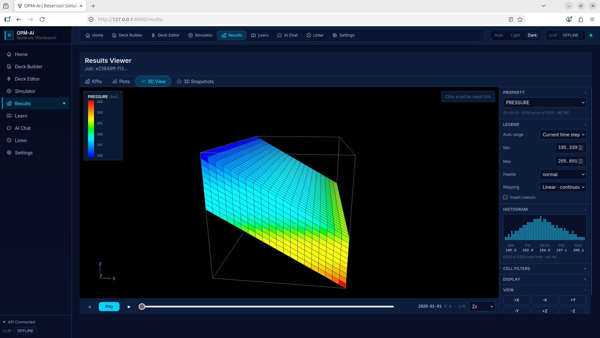
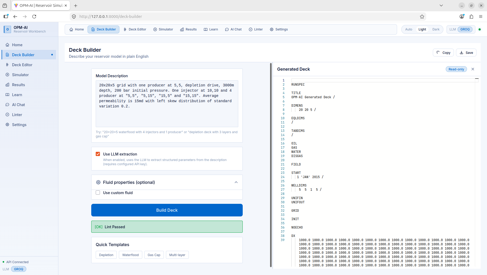
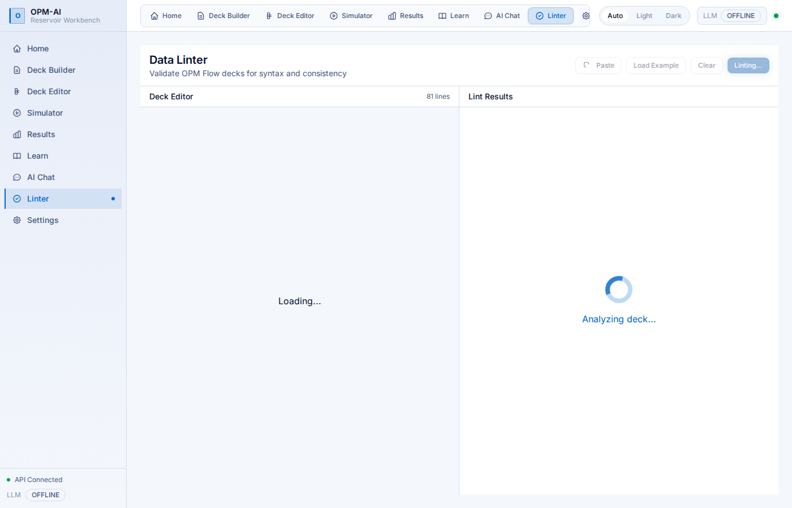
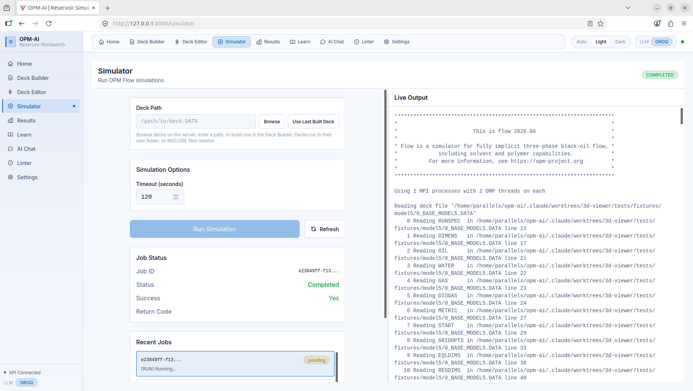
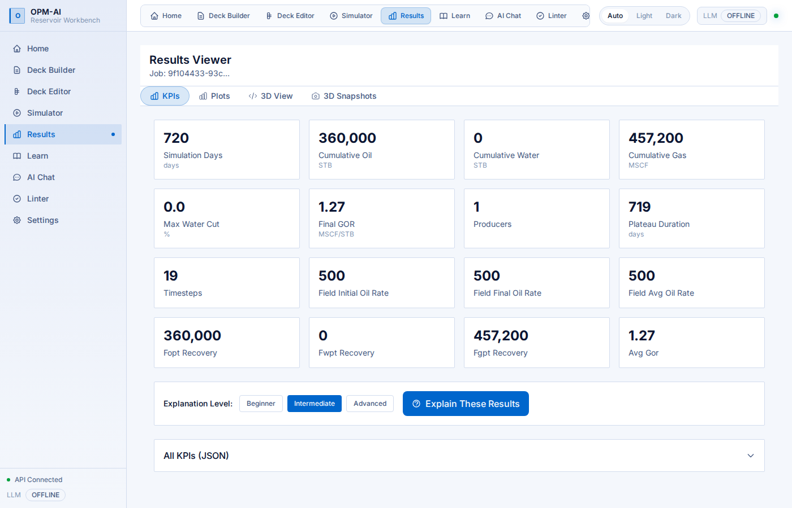
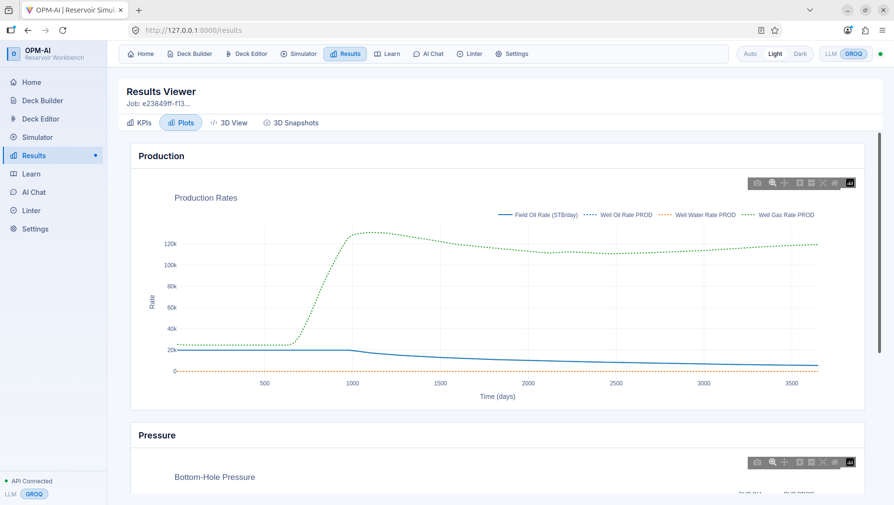
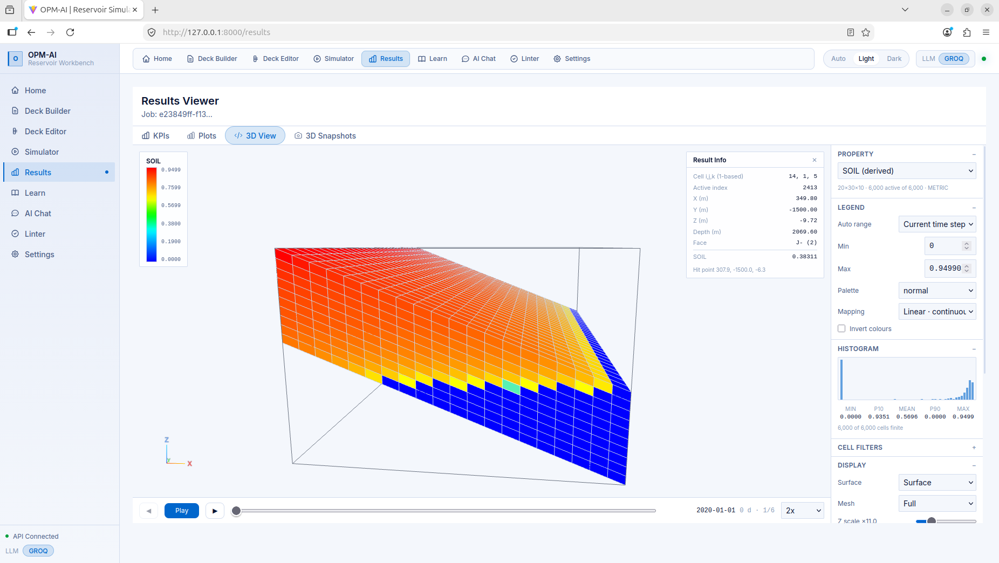
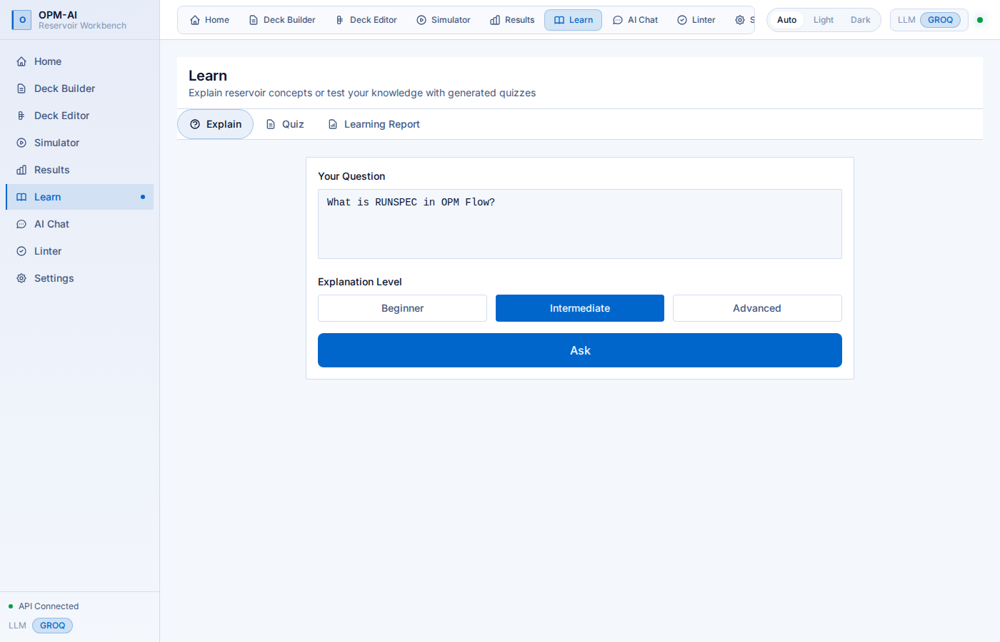
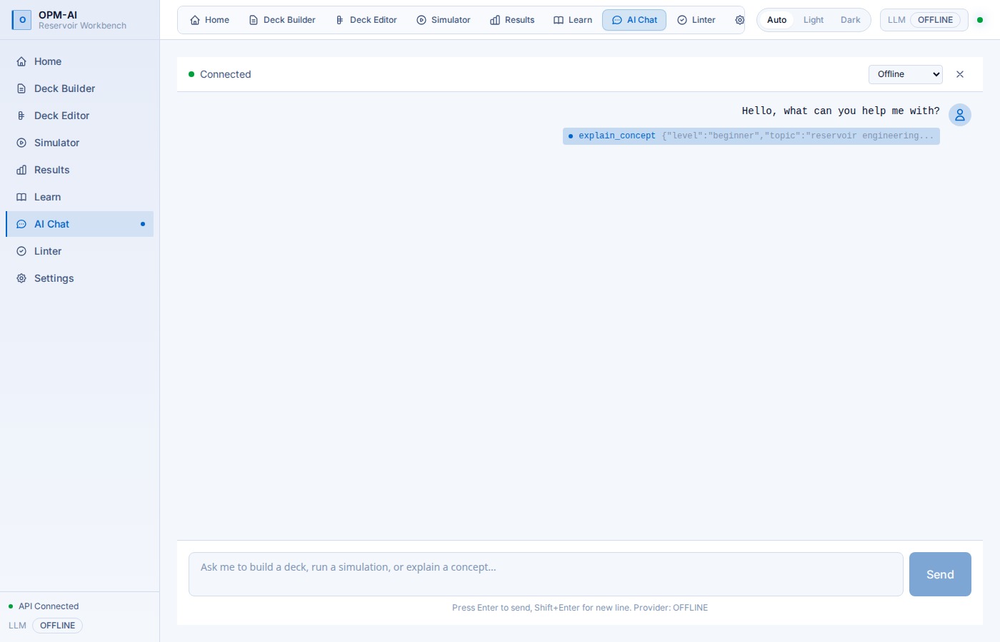

# OPM-AI

<p align="center">
  <strong>An AI-assisted workbench for reservoir simulation, built on the open-source OPM Flow simulator.</strong>
</p>

<p align="center">
  Describe a reservoir in plain English and it builds the deck, lints it, runs the simulation, and explains the results.
</p>

<p align="center">
  Made for students, researchers, and faculty who want to learn and teach reservoir engineering without fighting the tooling.
</p>

<p align="center">
  <a href="#features">Features</a> ·
  <a href="#screenshots">Screenshots</a> ·
  <a href="#quick-start">Quick start</a> ·
  <a href="#architecture">Architecture</a> ·
  <a href="#license-and-credits">License & Credits</a>
</p>

## Features

- **Build decks from plain English** — describe a model and get a valid OPM Flow deck, with an offline generator and optional LLM extraction
- **Lint decks offline** — a rule engine catches errors and inconsistencies before you run, no simulator needed
- **Run OPM Flow** — launch simulations and get structured results, with readable crash reports when a run fails
- **See the results** — field and per-well KPIs, interactive Plotly charts, and 3D snapshots via ResInsight
- **Chat with tools** — one conversation that builds, lints, runs, plots, and explains
- **Learn as you go** — concept explanations and auto-generated quizzes for reservoir topics
- **Dark, light, and auto themes** — sharp panels, rounded controls, follows your system setting

## Screenshots

### Home — dark theme (default)

<p align="center">
  
</p>

### Deck Builder

<p align="center">
  
</p>

### Linter

<p align="center">
  
</p>

### Simulator

<p align="center">
  
</p>

### Results — KPIs and tables

<p align="center">
  
</p>

### Results — Interactive Plotly charts

<p align="center">
  
</p>

### Results — 3D

<p align="center">
  
</p>

### Learn & Chat

| Learn | Chat |
|---|---|
|  |  |

### Light theme

<p align="center">
  
</p>

## Quick start

```bash
git clone https://github.com/pranay-gpt/opm-ai.git
cd opm-ai
docker compose up -d --build
# open http://localhost:8000
```

That's it. The frontend is built inside the image, so you don't need Node locally.
The app runs fully offline by default; to enable the LLM chat and extraction features,
copy `.env.example` to `.env` and add an API key (e.g. `GROQ_API_KEY` with `LLM_PROVIDER=groq`).

## Architecture

```text
opm-ai/
├── frontend/                React + Vite + TypeScript SPA
├── opm_ai/                  Python package (CLI, core, server)
│   ├── core/                Deck AST, linter, generator, parser
│   ├── server/              FastAPI app, WebSocket, runner
│   └── cli.py               Typer CLI entry point
├── tests/                   189 tests (pytest)
├── docker/                  Multi-stage Dockerfile, compose
├── docs/                    Screenshots, BUILD_GUIDE, CONTEXT, FORWARD_PLAN
└── scripts/                 Development helpers
```

The frontend uses React 18, TypeScript, Tailwind CSS, Plotly.js, and TanStack Query.
The backend uses FastAPI, OPM Flow (via Docker), and an optional LLM provider (Groq, OpenAI, Anthropic-compatible).
Communication is REST + WebSocket for live simulation logs.

## Development

| Command | Purpose |
|---------|---------|
| `docker compose up -d --build` | Full stack in containers |
| `pip install -e .[dev]` | Local Python dev environment |
| `pytest` | Run 189 tests |
| `ruff check .` | Lint Python |
| `mypy opm_ai` | Type check |
| `cd frontend && npm install && npm run dev` | Frontend dev server |

## License and Credits

Released under the [MIT License](LICENSE).

Built on [OPM Flow](https://opm-project.org/) by the [Open Porous Media initiative](https://github.com/OPM).
Reservoir simulation, the deck format, and the 3D post-processing all rest on the OPM team's work.
This project is an independent AI layer on top of their tools and is not affiliated with or endorsed by OPM.

**Author:** Pranay Gupta — [GitHub](https://github.com/pranay-gpt) · [LinkedIn](https://www.linkedin.com/in/pranay-ism/)