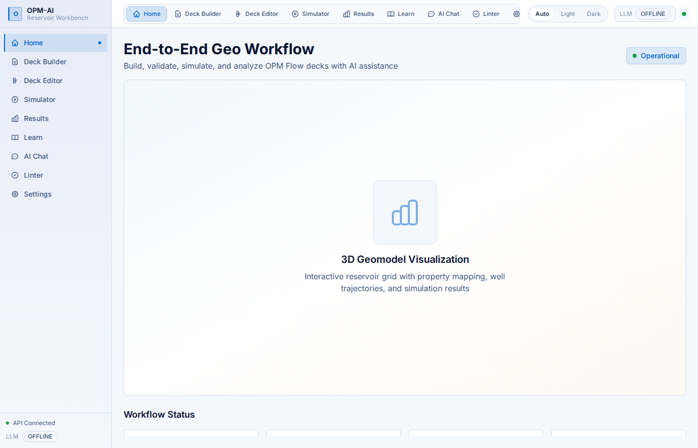
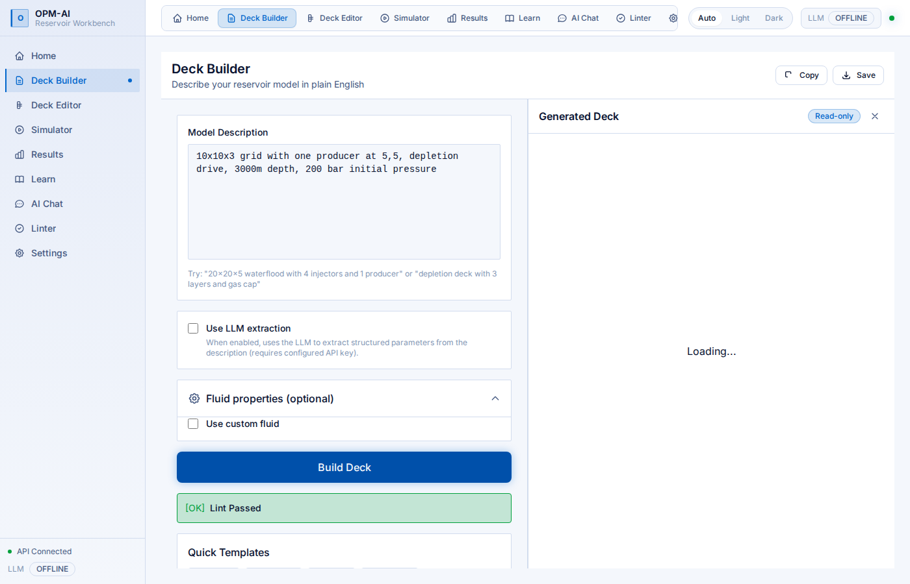
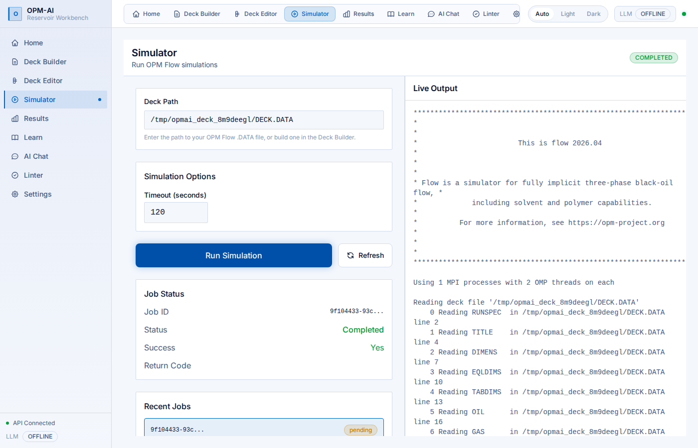

# OPM-AI

An AI-assisted workbench for reservoir simulation, built on the open-source OPM Flow simulator.
Describe a reservoir in plain English and it builds the deck, lints it, runs the simulation, and explains the results.
Made for students, researchers, and faculty who want to learn and teach reservoir engineering without fighting the tooling.

## Features

- **Build decks from plain English** — describe a model and get a valid OPM Flow deck, with an offline generator and optional LLM extraction
- **Lint decks offline** — a rule engine catches errors and inconsistencies before you run, no simulator needed
- **Run OPM Flow** — launch simulations and get structured results, with readable crash reports when a run fails
- **See the results** — field and per-well KPIs, interactive Plotly charts, and 3D snapshots via ResInsight
- **Chat with tools** — one conversation that builds, lints, runs, plots, and explains
- **Learn as you go** — concept explanations and auto-generated quizzes for reservoir topics
- **Dark, light, and auto themes** — sharp panels, rounded controls, follows your system setting

## Screenshots

| Home | Deck Builder |
|---|---|
|  |  |

| Linter | Simulator |
|---|---|
|  |  |

| Results | AI Chat |
|---|---|
|  |  |

| Learn | Light theme |
|---|---|
|  |  |

## Installation

```bash
git clone https://github.com/pranay-gpt/opm-ai.git
cd opm-ai
docker compose up -d --build
# open http://localhost:8000
```

That's it. The frontend is built inside the image, so you don't need Node locally.
The app runs fully offline by default; to enable the LLM chat and extraction features,
copy `.env.example` to `.env` and add an API key (e.g. `GROQ_API_KEY` with `LLM_PROVIDER=groq`).

## License and Credits

Released under the [MIT License](LICENSE).

Built on [OPM Flow](https://opm-project.org/) by the [Open Porous Media initiative](https://github.com/OPM).
Reservoir simulation, the deck format, and the 3D post-processing all rest on the OPM team's work.
This project is an independent AI layer on top of their tools and is not affiliated with or endorsed by OPM.
